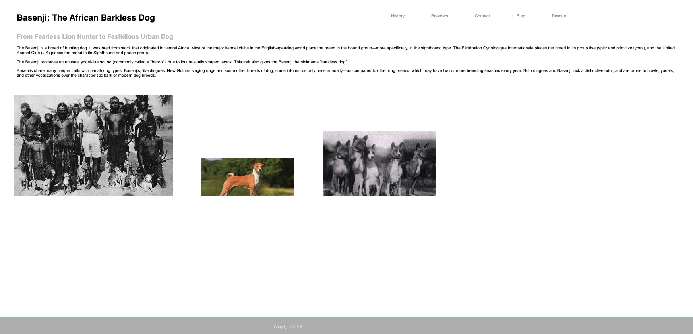

# african-barkless-dog
Past and present informational site about the ancient Basenji Breed which originated from the Congo region of Africa dating back at least 6000 years ago. These noble creatures were brought up the Nile as gifts to the Pharoahs of Egypt.

